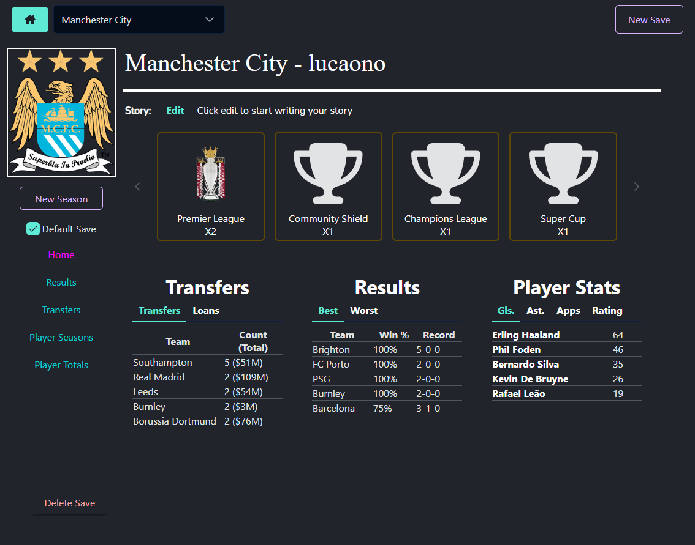
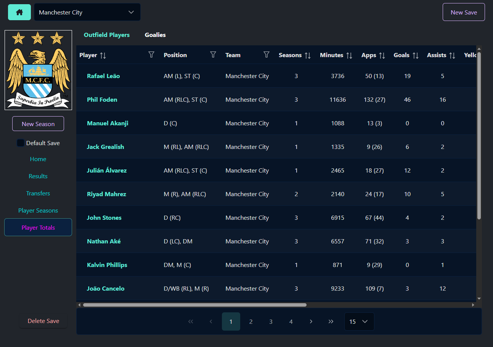

<h1 style="text-align:center; font-size: 50px" >Save Tracker</h1>

<br>

A side project I have been thinking about for a long time and finally got to making it a reality about a year ago (summer of 2022). Thought it would be a great application for the community since it would allow players to see their past players (and their stats/attributes too!), results, trophies, records or even which teams they just can't seem to beat. 

[There are specific views that are available at this link](https://app.mediafire.com/a1nr43y08ynii).

<sup>Currently the only supported version of FM is 2023, but I do plan on adding other games soon. You can create the views yourself as long as they are in the *exact* order as the ones that I have created are in. Otherwise the parsing of the data will be incorrect and might have errors.</sup>

Some notable features that I'm really excited about for this are the Save Story, where you can write your own story in the tracker, have an image to show off on the side for each save, a default save so the application alwa

Some notable features that I'm really excited about for:
  - Save Story to write your own story
  - Have the app open to a specific save immediately so it's easy to find
  - Keep track of your best players throught the save through different stats
  - Visualize a players attribute growth
  - Have images represent your save or even trophies
  - See which teams you have made the most transfers deal with (and how much they've cost!)
  - And some more!
<hr>

### Screenshots


### Tools Used:
  - [Wails (Go)](https://wails.io)
  - Typescript
  - Vue Framework
  - SQLite
  - [PrimeVue components](https://primevue.org)
  
### What you can track:
  - Attributes
  - Stats (both per season and overall)
  - Transfers
  - Results
  - Save Story
  - Trophies
  
### Installation
##### Only for Windows for now
Download the installer by going to releases on the right side or clicking <a href="https://github.com/lucaono13/savetracker/releases">here</a>.
### Screenshots
<!-- || -->
<table>
  <tr>
    <td>
      
      <p style="text-align: center">
        <em>New Save Dialog</em>
      </p>
    </td>
    <td>
      
      <p style="text-align: center">
        <em>New Season Dialog</em>
      </p>
    </td>
  </tr>
  <tr>
    <td>
      
      <p style="text-align: center">
        <em>Save Home with no Data</em>
      </p>
    </td>
    <td>
      
      <p style="text-align: center">
        <em>Save Home with Data</em>
      </p>
    </td>
  </tr>
  <tr>
    <td>
      
      <p style="text-align: center">
        <em>Results</em>
      </p>
    </td>
    <td>
      
      <p style="text-align: center">
        <em>Transfers</em>
      </p>
    </td>
  </tr>
  <tr>
    <td>
      
      <p style="text-align: center">
        <em>Player Seasons</em>
      </p>
    </td>
    <td>
      
      <p style="text-align: center">
        <em>Player Totals</em>
      </p>
    </td>
  </tr>
  <tr>
    <td>
      
      <p style="text-align: center">
        <em>Player Dialog (Stats)</em>
      </p>
    </td>
    <td>
      
      <p style="text-align: center">
        <em>Player Dialog (Attributes)</em>
      </p>
    </td>
  </tr>
</table>


### Just some ideas for what I might want to do in the future<sup style="font-size:x-small">No guarantee I will add any of these</sup>:
  - [ ] Backups
  - [ ] Comparisons between players
  - [ ] League Positions
  - [ ] Coaching Staff
  - [ ] Formations
  - [ ] Team Info (Facilities, Stadium name, capacity, etc)
  - [ ] Youth Intakes
  - [ ] ~~Manager Timelines~~ *Currently not exportable*
  - [ ] Easy export to share with others

<hr>

### Development
1. Clone repo.
2. Ensure that Go is installed by going to https://go.dev/dl
3. In project directory run command: 
``` go mod download ```
4. Run ```wails dev ``` to run a dev environment of the application.

*Note: because of the go:embed command in main.go, you either have to save a .go file (there doesn't have to be any changes) or add a space between // and go:embed on line 18 in main.go*
